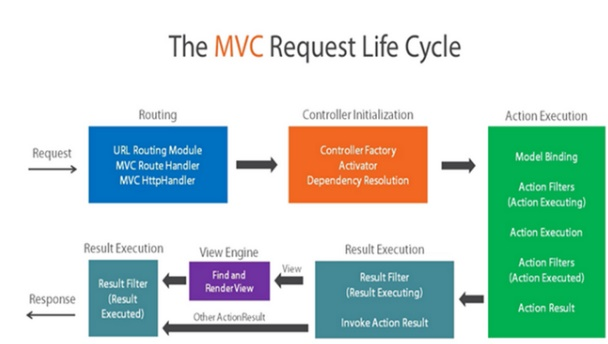
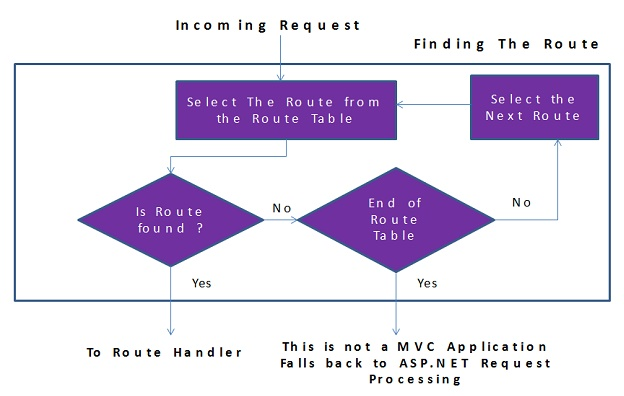
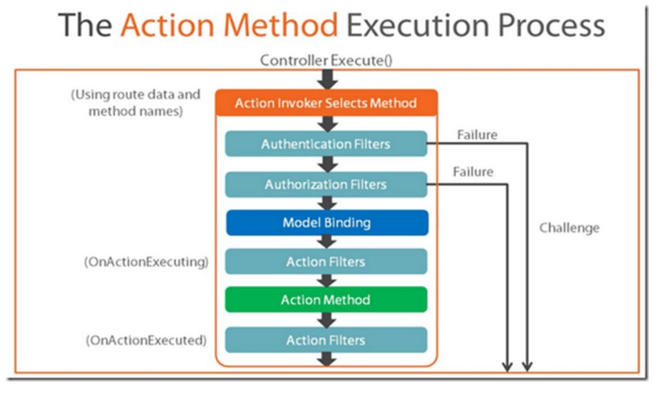

# Table of Contents
1. [Application lifecycle](#application-lifecycle)
2. [Request lifecycle](#request-lifecycle)
   1. [Routing](#routing)
      1. [Url Routing Module](#url-routing-module)
      2. [Route Handler](#route-handler)
      3. [Http Handler](#htp-handler)
   2. [Controller Initialization](#controller-initialization)
   3. [Action Execution](#action-execution)
      1. [Action Invoker](#action-invoker)
      2. [Model Binding](#modle-binding)
      3. [Filters](#filters)
         1. [Filter filters](#filter-types)
         2. [Existing types](#existing-filters)
         3. [Filter creation](#filter-creation)
            1. [Override On<Filter> methods](#override-on<filter>-methods)
            2. [Derive from ActionFilterAttribute](#derive-from-actionfilterattribute) 
   4. [Result Execution](#result-execution)
3. [Http module](#http-module)

# Application lifecycle
MVC Application lifecycle contains two events:
- Start event: fired when the application is brought to life by a very first request to the application. 
- End event: fired when the application has been shut down.


MVC application provide two handlers to these events in Global.asax file. Start handler is usually used to register all areas of MVC application, installing global filters, adding routes and bundles.


# Request lifecycle


## Routing

### Url Routing Module
It analyses the request and looks up Routing table to find the controller the incoming request maps to.


It analyses the request and makes the route selection. It loops through the RouteData from a RouteTable and selects the first route which matches the current URL. If no routes found then the Url Routing Module sends the request to regular ASP.NET or IIS request processing.



Routes are added in the start handler in the Global.asax file. You have many way to add them:
- Use Route object
```C#
var routeValue = new RouteValueDictionary
{
    { "Controller", "Home" },
    { "Action", "Index" }
};
routes.Add(new Route("home", routeValue, new MvcRouteHandler()));
```
- Use MapRoute from the RouteCollection object
```C#
routes.MapRoute(
    name: "Default",
    url: "{controller}/{action}/{id}",
    defaults: new { controller = "Home", action = "Index", id = UrlParameter.Optional }
```
- Use MapMvcAttributeRoutes
```C#
routes.MapMvcAttributeRoutes();

public class HomeController : Controller
{
    [Route("Home", Name = "Index")]
    public ActionResult Index()
    {
        return View();
    }
}
```

You can define constraints to a route by using:
- Regular expressions
  - Using MapRoute
    ```C#
    routes.MapRoute(
        name: "RegExpRouteConstraint",
        url: "TestRouteConstraint/Regexp/{user}",
        defaults: new { controller = "TestRouteConstraint", action = "RegularExpressionConstraint", user = UrlParameter.Optional },
        constraints: new { user = "rdiegoni" } // 'user' identifies the parameter that the constraint applies to
    );

    // localhost/TestRouteConstraint/Custom/rdiegoni resource found
    // localhost/TestRouteConstraint/Custom/xxx resource not found
    ```

  - Using RouteAttribute
    ```C#
    [Route("TestRouteConstraint/Regexp/{user:regex(rdiegoni)}", Name = "TestRouteConstraint_RegularExpressionConstraint")]
    public ActionResult RegularExpressionConstraint(string user)
    {
        ViewBag.Message = "Regular Expression Constraint sucess";
        return View("Result");
    }
    ```

- Objects that implement the IRouteConstraint interface 
    ```C#
    public class CustomRouteConstraint: IRouteConstraint
    {
        private readonly List<string> users;

        public CustomRouteConstraint(string users)
        {
            this.users = users.Split('|').Select(x => x.ToLower()).ToList();
        }

        public bool Match(
            HttpContextBase httpContext, 
            Route route, 
            string parameterName, 
            RouteValueDictionary values,
            RouteDirection routeDirection)
        {
            var value = values[parameterName].ToString();
            return users.Contains(value.ToLower());
        }
    }
    ```

    Then, register it in Global.asax file
    ```C#
    var constraintsResolver = new DefaultInlineConstraintResolver();
    constraintsResolver.ConstraintMap.Add("match", typeof(CustomRouteConstraint));
    ```

  - Using MapRoute
    ```C#
    routes.MapRoute(
        name: "CustomRouteConstraint",
        url: "TestRouteConstraint/Custom/{user}",
        defaults: new { controller = "TestRouteConstraint", action = "CustomRouteConstraint", user = UrlParameter.Optional },
        constraints: new { user = new CustomRouteConstraint("rdiegoni") } // 'user' identifies the parameter that the constraint applies to
    );
    ```

  - Using RouteAttribute
    ```C#
    [Route("TestRouteConstraint/Custom/{user:match(rdiegoni)}", Name = "TestRouteConstraint_CustomRouteConstraint")]
    public ActionResult CustomRouteConstraint(string user)
    {
        ViewBag.Message = "Custom Route Constraint sucess";
        return View("Result");
    }
    ```

### Route Handler
It is a class returning the http handler that will handle the incoming request.

To create a new route handler, you need to create a class that derives from IRouteHandler and return an instance of the custom handler in the GetHttpHandler method.
```C#
public class CustomRouteHandler : IRouteHandler
{
    public IHttpHandler GetHttpHandler(RequestContext requestContext)
    {
        return new CustomHttpHandler();
    }
}
```

Then, you need to associate this handler to the routes you want to apply with.
```C#
routes.Add(new Route("route", new CustomRouteHandler()));
```

MVC uses MVCRouteHandler as a default route handler.

### Http Handler

It is a class that provides a response to the incoming request. 

To create a custom http handler, you need to create a class that derives from IHttpHandler.
```C#
public class CustomHttpHandler: IHttpHandler
{
    public void ProcessRequest(HttpContext context)
    {
        context.Response.Redirect("https://github.com/drioemgaoin", true);
    }
}
```

MVC uses MVCHttpHandler as a default http handler. It is the entry point of MVC framework.

There are two sets of events in the MVC request lifecycle that concerns HttpHandlers:
- MapRequestHandler and PostMapRequestHandler: determines the httpHandler responsible for executing the request. Only the selection happens during this time.
- RequestHandlerExecute and PostRequestHandlerExecute: executes the htttp handler determined in the earlier phases of request lifecycle.


## Controller Initialization


Once the http handler determinated, it starts to process the request by inspecting the RequestContext to get the name of the Controller from the URL. 

Then, it uses the ControllerBuilder to get the ControllerFactory instance. 

Then, it passes the name of the Controller and RequestContext to the CreateController (ControllerFactory method) to create the controller by using Controller Activator and Dependency Resolver. If no dependency resolved was found then Controller Activator manually creates an instance of controller and returns it for execution. Once the controller has been initialized MvcHandler calls controller.Execute() method to begin processing execution.

Finally, it calls the controller’s Execute method and passes the RequestContext to Controller.

MVC uses DefaultControllerFactory as a default controller factory. 

To create a custom controller factory, you need to:
- Create a class that derives from IControllerFactory (or DefaultControllerFactory).
```C#
public class CustomControllerFactory : IControllerFactory
{
    // You can use your favourite IoC tool to inject the dependencies needed by each controller
    // Activator.CreateInstance(controller, dependencies)

    public IController CreateController(RequestContext requestContext, string controllerName)
    {
        var controllername = $"{requestContext.RouteData.Values["controller"]}Controller";

        var controllers = GetControllers();
        var controller = controllers.FirstOrDefault(x => x.Name == controllername);
        if (controller != null)
        {
            return Activator.CreateInstance(controller) as IController;
        }

        return null;
    }

    public SessionStateBehavior GetControllerSessionBehavior(RequestContext requestContext, string controllerName)
    {
        return SessionStateBehavior.Default;
    }

    public void ReleaseController(IController controller)
    {
        var dispose = controller as IDisposable;
        dispose?.Dispose();
    }

    private static IEnumerable<Type> GetControllers()
    {
        var myAssembly = Assembly.GetExecutingAssembly();
        return myAssembly.GetTypes()
            .Where(x => x.IsClass && x.Name.EndsWith("Controller")).ToList();
    }
}
```
- Set this factory as a new controller factory in Global.asax file.
```C#
ControllerBuilder.Current.SetControllerFactory(typeof(CustomControllerFactory));
```

## Action Execution


Once the controller has been chosen and initialized, execution start by using an Action Invoker that will select appropriate method using route data and method names.

Once the selection is done, Authentication filters fires to ensure that current user is authenticated. If the authentication fails then a challenge is sent back to the use, which could involve redirect user to a login page. If the authentication passes, request moves ahead with authorization filter. Once again, the same process happens, if the user is not authorized, then a challenge is sent back to browser, otherwise request pipeline moves.

Once the authentication and authorization are passed, request moves to the model binding step which collects data from query string, route data and request to generate objects required by Action method.

Once the model binding has been done, Action filters are triggered. Before action method is executed, an action filter is executed (OnActionExecuting) and after action method is executed, an action filter is executed (OnActionExecuted).

### Action Invoker
It has the responsibilities of finding the action method in the controller and then invoking the action method.

To create a custom action invoker, you need to:
- Create a class that derives from IActionInvoker (or ControllerActionInvoker)
```C#
public class CustomControllerActionInvoker: IActionInvoker
{
    public bool InvokeAction(ControllerContext controllerContext, string actionName)
    {
        var view = new StringBuilder();
        view.Append("<div>");
        view.Append("Content generated by my custom controller action invoker");
        view.Append("</div>");
        controllerContext.HttpContext.Response.Write(view.ToString());
        return true;
    }
}
```
- Replace, in the controller factory, the action invoker for each concerned controller 
```C#
mvcController.ActionInvoker = new CustomControllerActionInvoker();
```

### Model Binding
It is the process that maps data from request to the method parameters.

When MVC receives an HTTP request, it routes it to a specific action method of a controller. It determines which action method to run based on what is in the route data, then it binds values from the HTTP request to that action method’s parameters. 

MVC will try to bind request data to the action parameters by name. MVC will look for values for each parameter using the parameter name and the names of its public settable properties. 

MVC uses DefaultModelBinder as a default model binder. It binds the following objects:
- Types primitifs, such as objets String, Double, Decimal et DateTime.
- Classes de modèle, such as Person, Address et Product.
- Collections, such as ICollection<T>, IList<T> et IDictionary<TKey, TValue>

To create a custom model binder, you need to:
- Create a class that derives from IModelBinder (or DefaultModelBinder)
```C#
public class CustomModelBinder : IModelBinder
{
    public object BindModel(ControllerContext controllerContext,
                            ModelBindingContext bindingContext)
    {
        var request = controllerContext.HttpContext.Request;

        var day = request.Form.Get("Day");
        var month = request.Form.Get("Month");
        var year = request.Form.Get("Year");

        return new DateModel
        {
            Date = day + "/" + month + "/" + year
        };
    }
}
```
- Register it in the ModelBinders in the Global.asax file
```C#
ModelBinders.Binders.Add(typeof(DateModel), new CustomModelBinder());
```

Model binding looks through default value providers, in the order, which are the components that feed data to model binders:
- Form values: These are form values that go in the HTTP request using the POST method. (including jQuery POST requests).
- Route values: The set of route values provided by routing.
- Query strings: The query string part of the URI.

To create a custom value providers, you need to:
- Create a class that derives from IValueProvider
```C#
public class CustomValueProvider: IValueProvider
{
    public bool ContainsPrefix(string prefix)
    {
        return HttpContext.Current.Request.Cookies[prefix] != null;
    }

    public ValueProviderResult GetValue(string key)
    {
        return new ValueProviderResult(
            HttpContext.Current.Request.Cookies[key].Value,
            HttpContext.Current.Request.Cookies[key].Value,
            CultureInfo.CurrentCulture);
    }
}
```
- Create a class that derives from ValueProviderFactory which will create the new value provider
```C#
public class CustomValueProviderFactory: ValueProviderFactory
{
    public override IValueProvider GetValueProvider(ControllerContext controllerContext)
    {
        return new CustomValueProvider();
    }
}
```
- Add the new value provider factory to the ValueProvidersFactories in Global.asax
```C#
ValueProviderFactories.Factories.Add(new CustomValueProviderFactory());
```

In order for binding to happen, the class must have a public default constructor and member to be bound must be public writable properties. When model binding happens the class will only be instantiated using the public default constructor, then the properties can be set.

When a parameter is bound, model binding stops looking for values with that name and it moves on to bind the next parameter. If binding fails, MVC does not throw an error. You can query for model state errors by checking the ModelState.IsValid property.

MVC contains several attributes that you can use to direct its default model binding behavior to a different source.
- BindRequired: add a model state error if binding cannot occur.
- BindNever: tells to the model binder to never bind this paramater.
- FromHeader: tells to Model binder to search the binding value from the request's header.
- FromQuery: tells to Model binder to search the binding value from the query string. 
- FromRoute: tells to Model binder to search the binding value from the route.
- FromForm: tells to Model binder to search the binding value from the from.
- FromServices: tells to Model binder to use DI (Dependency Injection) to bind the parameters from the Services.
- FromBody: tells to Model binder to search the binding value from request body. It uses configured formatter to bind the value from the body and formatter is defined in the content type of the request.
- ModelBinder: tells to Model binding to use custom model binder to bind the parameters. 

Request data can come in a variety of formats including JSON, XML and many others. When you use the [FromBody] attribute to indicate that you want to bind a parameter to data in the request body, MVC uses a configured set of formatters to handle the request data based on its content type. By default MVC includes a JsonInputFormatter class for handling JSON data, but you can add additional formatters for handling XML and other custom formats.

ASP.NET selects input formatters based on the Content-Type header and the type of the parameter.

### Filters
Filters are custom classes that provide both a declarative and programmatic means to add pre-action and post-action behavior to controller action methods.

#### Filter types
ASP.NET MVC supports the following types of action filters:
- Authentication filters: to implement authentication. It runs before any other filter or action method. These implement IAuthenticationFilter.
- Authorization filters: to implement authorization. It runs after the Authentication filter and before any other filter or action method. These implement IAuthorizationFilter.
- Action filters:  These implements IActionFilter. It runs before and after any action method. There are 2 events available:
  - OnActionExecuting - Runs before execution of Action method.
  - OnActionExecuted - Runs after execution of Action method.
- Result filters: These implements IResultFilter. It runs before and after execution of any action result. There are 2 events available:
  - OnResultExecuting - Runs before content is rendered to View.
  - OnResultExecuted - Runs after content is rendered to view.
- Exception filters: This filter is used to capture any exceptions if raised by controller or an action method. These implement IExceptionFilter.

#### Existing filter
Some filters are provided by Asp.Net implemented as attributes. The filters can be applied at the action method, controller, or application level.
- AuthorizeAttribute: Restricts access by authentication and optionally authorization. (customErrors element need to enabled in the Web.config file to work)
- HandleErrorAttribute: Specifies how to handle an exception that is thrown by an action method.
- OutputCacheAttribute: Provides output caching.
- RequireHttpsAttribute: Forces unsecured HTTP requests to be resent over HTTPS.

#### Filter creation
##### Override On<Filter> methods
You can override one or more of controller's On<Filter> methods.
```C#
protected override void OnActionExecuting(ActionExecutingContext filterContext)
{
    base.OnActionExecuting(filterContext);
    TempData["time"] = Stopwatch.StartNew();
}

protected override void OnActionExecuted(ActionExecutedContext filterContext)
{
    base.OnActionExecuted(filterContext);

    var stopWatch = TempData["time"] as Stopwatch;
    if (stopWatch != null)
    {
        stopWatch.Stop();

        var result = filterContext.Result as ViewResult;
        if (result != null)
        {
            ((FilterModel)result.Model).ExecutionTime = stopWatch.Elapsed.TotalMilliseconds;
        }
    }
}
```

##### Derive from ActionFilterAttribute
To create a new ActionFilterAttribute, you need to:
- Create a class that derives from ActionFilterAttribute
```C#
public class ExecutionActionFilterAtttribute: ActionFilterAttribute, IActionFilter
{
    private readonly Stopwatch stopWatch;

    public ExecutionActionFilterAtttribute()
    {
        stopWatch = new Stopwatch();
    }

    public override void OnActionExecuting(ActionExecutingContext filterContext)
    {
        stopWatch.Reset();
        stopWatch.Start();
    }

    public override void OnActionExecuted(ActionExecutedContext filterContext)
    {
        stopWatch.Stop();

        var result = filterContext.Result as ViewResult;
        if (result != null)
        {
            ((FilterModel)result.Model).ExecutionTime = stopWatch.Elapsed.TotalMilliseconds;
        }
    }
}
```
- Apply this attribute over the controller's method you want.
```C#
[ExecutionActionFilterAtttribute()]
[Route("FilterByCustomActionFilterAttribute", Name = "FilterByCustomActionFilterAttribute")]
public ActionResult FilterByCustomActionFilterAttribute()
{
    return View("Index", new FilterModel());
}
```

##### FilterProviders
You can register several provider in the FilterProviders.

By default, ASP.NET MVC registers the following filter providers:
- GlobalFilters.Filters for global filters.
- FilterAttributeFilterProvider for filter attributes.
- ControllerInstanceFilterProvider for controller instances.

To create a custom filter provider, you need to:
- Create a class that derives from IFilterProvider
```C#
public class CustomFilterProvider: IFilterProvider
{
    public IEnumerable<System.Web.Mvc.Filter> GetFilters(
        ControllerContext controllerContext, 
        ActionDescriptor actionDescriptor)
    {
        if (actionDescriptor.ControllerDescriptor.ControllerName == "TestFilter")
        {
            if (actionDescriptor.ActionName == "FilterByCustomFilterProvider")
            {
                yield return new System.Web.Mvc.Filter(new ExecutionActionFilterAtttribute(), FilterScope.Action, 0);
            }
        }
    }
}
```
- Register this new provider in the provider collection
```C#
FilterProviders.Providers.Add(new CustomFilterProvider());
```

##### GlobalFilterCollection
To use GlobalFilters, you need to:
- Create a class that derives from IActionFilter, IAuthorizedAttribute, IExceptionAttribute or IResultAttribute
```C#
public class CustomGlobalFilter: IActionFilter
{
    private readonly Stopwatch stopWatch;

    public CustomGlobalFilter()
    {
        stopWatch = new Stopwatch();
    }

    public void OnActionExecuting(ActionExecutingContext filterContext)
    {
        stopWatch.Reset();
        stopWatch.Start();
    }

    public void OnActionExecuted(ActionExecutedContext filterContext)
    {
        stopWatch.Stop();

        if (filterContext.ActionDescriptor.ControllerDescriptor.ControllerName == "TestFilter")
        {
            if (filterContext.ActionDescriptor.ActionName == "FilterByGlobalFilter")
            {
                var result = filterContext.Result as ViewResult;
                if (result != null)
                {
                    ((FilterModel)result.Model).ExecutionTime = stopWatch.Elapsed.TotalMilliseconds;
                }
            }
        }
    }
}
```
- Register this new provider in the global filter collection
```C#
GlobalFilters.Filters.Add(new CustomGlobalFilter());
```

#### Filter order
Filters run in the following order:
- Authentication filters
- Authorization filters
- Action filters
- Result filters
- Exception filters

#### Filter scope
Within each filter type, the Order value specifies the run order. Within each filter type and order, the Scope enumeration value specifies the order for filters. This enumeration defines the following filter scope values (in the order in which they run):
- First: specifies first.
- Global: specifies an order before Controller and after First.
- Controller: specifies an order before Action and after Global.
- Action: specifies an order before Last and after Controller.
- Last: specifies last.

#### Filter cancellation

## Result Execution


# Http Module

It is an assembly that is called on every request that is made to your application.

You can override the default behavior or add custom logic by letting you attach event handlers to HttpApplication events. 

To create a custom http handler, we need to
- Create a class that derives from IHttpModule
```C#
public class MyHttpModule: IHttpModule
{
    private bool disposed;
    private HttpApplication context;

    public void Init(HttpApplication context)
    {
        this.context = context;

        // With the context with have access to all http application events
        context.BeginRequest += OnBeginRequest;
    }

    private void OnBeginRequest(object sender, EventArgs e)
    {
        // CODE HERE
    }

    public void Dispose()
    {
        Dispose(true);
        GC.SuppressFinalize(this);
    }

    private void Dispose(bool disposing)
    {
        if (disposing)
        {
            if (!disposed)
            {
                context.BeginRequest -= OnBeginRequest;
                disposed = false;
            }
        }
    }
} 
```
- Create a class that register the new http module
```C#
public static class MyHttpModuleRegistration
{
    public static void Initialize()
    {
        DynamicModuleUtility.RegisterModule(typeof(MyHttpModule));
    }
}
```
- Run the registration before application start by adding the following line in the AssemblyInfo.cs
```C#
[assembly: PreApplicationStartMethod(typeof(MyHttpModuleRegistration), "Initialize")]
```
