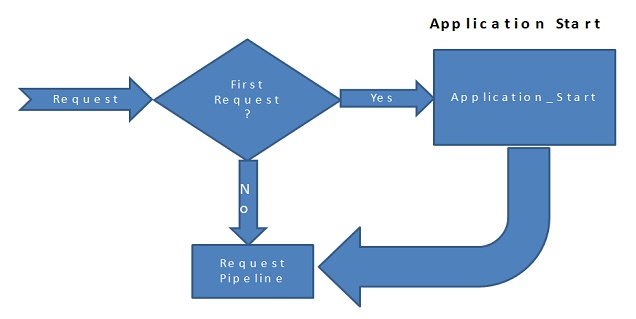
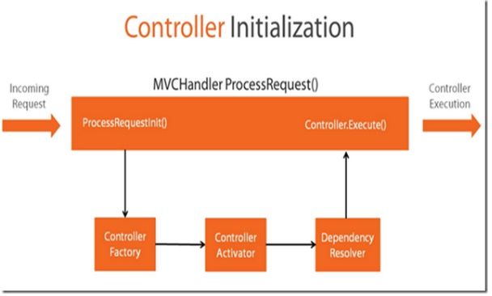

# Application lifecycle
MVC Application lifecycle contains two events:
- Start event: fired when the application is brought to life by a very first request to the application. 
- End event: fired when the application has been shut down.



MVC application provide two handlers to these events in Global.asax file. Start handler is usually used to register all areas of MVC application, installing global filters, adding routes and bundles.


# Request lifecycle


## Routing

### Url Routing Module
It analyses the request and looks up Routing table to find the controller the incoming request maps to.


It analyses the request and makes the route selection. It loops through the RouteData from a RouteTable and selects the first route which matches the current URL. If no routes found then the Url Routing Module sends the request to regular ASP.NET or IIS request processing.


Routes are added in the start handler in the Global.asax file. You have many way to add them:
- Use Route object
```C#
var routeValue = new RouteValueDictionary
{
    { "Controller", "Home" },
    { "Action", "Index" }
};
routes.Add(new Route("home", routeValue, new MvcRouteHandler()));
```
- Use MapRoute from the RouteCollection object
```C#
routes.MapRoute(
    name: "Default",
    url: "{controller}/{action}/{id}",
    defaults: new { controller = "Home", action = "Index", id = UrlParameter.Optional }
```
- Use MapMvcAttributeRoutes
```C#
routes.MapMvcAttributeRoutes();

public class HomeController : Controller
{
    [Route("Home", Name = "Index")]
    public ActionResult Index()
    {
        return View();
    }
}
```

You can define constraints to a route by using:
- Regular expressions
```C#
routes.MapRoute(
    name: "Default",
    url: "{controller}/{action}/{id}",
    defaults: new { controller = "Home", action = "Index", id = UrlParameter.Optional },
    constraints: new { id = @"\d+" } // 'id' identifies the parameter that the constraint applies to
);

// localhost/Home/Index/2 resource found
// localhost/Home/Index/xxx resource not found
```
- Objects that implement the IRouteConstraint interface 
```C#
public class UserRouteConstraint: IRouteConstraint
{
    private readonly List<string> users;

    public UserRouteConstraint(params string[] users)
    {
        this.users = users.Select(x => x.ToLower()).ToList();
    }

    public bool Match(
        HttpContextBase httpContext, 
        Route route, 
        string parameterName, 
        RouteValueDictionary values,
        RouteDirection routeDirection)
    {
        var value = values[parameterName].ToString();
        return users.Contains(value.ToLower());
    }
}

routes.MapRoute(
    name: "Admin",
    url: "Account/Index/{user}",
    defaults: new { controller = "Account", action = "Index", user = UrlParameter.Optional },
    constraints: new { user = new UserRouteConstraint("rdiegoni") } // 'user' identifies the parameter that the constraint applies to
);
```

### Route Handler
It is class returning the http handler that will handle the incoming request.

To create a new route handler, you need to create a class that derives from IRouteHandler and return an instance of the custom handler in the GetHttpHandler method.
```C#
public class MyRouteHandler : IRouteHandler
{
    public IHttpHandler GetHttpHandler(RequestContext requestContext)
    {
        return new MyHttpHandler();
    }
}
```

Then, you need to associate this handler to the routes you want to apply with.
```C#
routes.Add(new Route("route", new MyRouteHandler()));
```

MVC uses MVCRouteHandler as a default route handler.

### Http Handler

It is a class that provides a response to the incoming request. 

To create a custom http handler, you need to create a class that derives from IHttpHandler.
```C#
public class MyHttpHandler: IHttpHandler
{
    public void ProcessRequest(HttpContext context)
    {
        context.Response.Redirect("https://github.com/drioemgaoin", true);
    }
}
```

MVC uses MVCHttpHandler as a default http handler. It is the entry point of MVC framework.

There are two sets of events in the MVC request lifecycle that concerns HttpHandlers:
- MapRequestHandler and PostMapRequestHandler: determines the httpHandler responsible for executing the request. Only the selection happens during this time.
- RequestHandlerExecute and PostRequestHandlerExecute: executes the htttp handler determined in the earlier phases of request lifecycle.


## Controller Initialization


Once the http handler determinated, it starts to process the request by inspecting the RequestContext to get the name of the Controller from the URL. 

Then, it uses the ControllerBuilder to get the ControllerFactory instance. 

Then, it passes the name of the Controller and RequestContext to the CreateController (ControllerFactory method) to create the controller by using Controller Activator and Dependency Resolver. If no dependency resolved was found then Controller Activator manually creates an instance of controller and returns it for execution. Once the controller has been initialized MvcHandler calls controller.Execute() method to begin processing execution.

Finally, it calls the controller’s Execute method and passes the RequestContext to Controller.

MVC uses DefaultControllerFactory as a default controller factory. 

To create a custom controller factory, you need to:
- Create a class that derives from IControllerFactory (or DefaultControllerFactory).
```C#
public class MyControllerFactory : IControllerFactory
{
    public IController CreateController(RequestContext requestContext, string controllerName)
    {
        var controllername = requestContext.RouteData.Values["controller"].ToString();

        var controllerType = Type.GetType($"Frontend.Controllers.{controllername}Controller");

        return Activator.CreateInstance(controllerType) as IController;
    }

    public SessionStateBehavior GetControllerSessionBehavior(RequestContext requestContext, string controllerName)
    {
        return SessionStateBehavior.Default;
    }

    public void ReleaseController(IController controller)
    {
        var dispose = controller as IDisposable;
        dispose?.Dispose();
    }
}
```
- Set this factory as a new controller factory in Global.asax file.
```C#
ControllerBuilder.Current.SetControllerFactory(typeof(MyControllerFactory));
```

## Action Execution

## Result Execution


# Http Module

It is an assembly that is called on every request that is made to your application.

You can override the default behavior or add custom logic by letting you attach event handlers to HttpApplication events. 

To create a custom http handler, we need to
- Create a class that derives from IHttpModule
```C#
public class MyHttpModule: IHttpModule
{
    private bool disposed;
    private HttpApplication context;

    public void Init(HttpApplication context)
    {
        this.context = context;

        // With the context with have access to all http application events
        context.BeginRequest += OnBeginRequest;
    }

    private void OnBeginRequest(object sender, EventArgs e)
    {
        // CODE HERE
    }

    public void Dispose()
    {
        Dispose(true);
        GC.SuppressFinalize(this);
    }

    private void Dispose(bool disposing)
    {
        if (disposing)
        {
            if (!disposed)
            {
                context.BeginRequest -= OnBeginRequest;
                disposed = false;
            }
        }
    }
} 
```
- Create a class that register the new http module
```C#
public static class MyHttpModuleRegistration
{
    public static void Initialize()
    {
        DynamicModuleUtility.RegisterModule(typeof(MyHttpModule));
    }
}
```
- Run the registration before application start by adding the following line in the AssemblyInfo.cs
```C#
[assembly: PreApplicationStartMethod(typeof(MyHttpModuleRegistration), "Initialize")]
```
